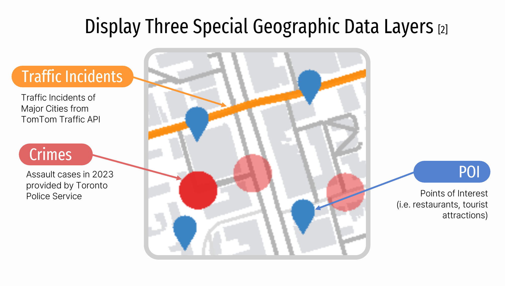
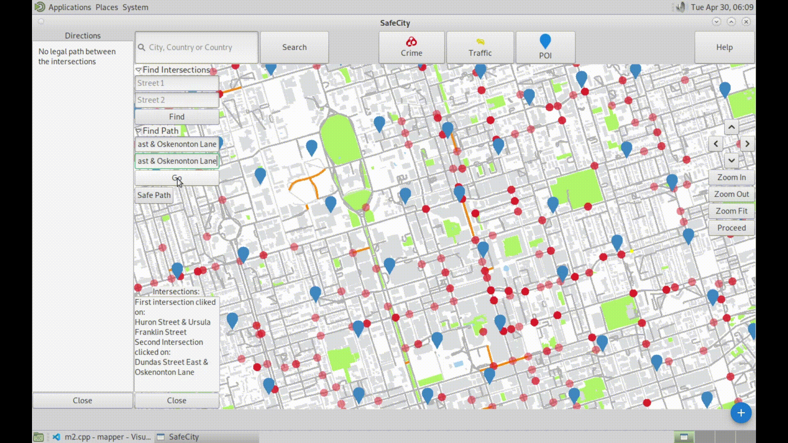

# ECE297 Final Project - SafeCity
SafeCity is a GIS-based application designed to improve urban safety by mapping and visualizing dangerous areas in Toronto based on incidents reported in 2023. Leveraging Geographic Information Systems (GIS) technology, SafeCity provides real-time information on high-risk zones, enabling users to make informed decisions about their routes and locations. By highlighting areas prone to crime and other incidents, SafeCity empowers users to navigate the city more safely.

## Key Features
### 1. Incident Mapping
- Visualizes Points of Interest (POIs) in major cities.
- Displays 2023 crime incidents in Toronto sourced from the Toronto Police Service CSV.
- Shows real-time traffic incidents via the TomTom traffic API.
- Clicking on map elements opens a sidebar with incident details such as type, date, and neighborhood.

 
### 2. User-Friendly Interface
- Analyzes incident concentration on the map.
- Adjusts map elements dynamically based on zoom level for improved visibility.

### 3. Path Finding with A* algorithm
- Efficient route planning considering travel time and street turn penalties.
- Process:
1. Initialize: Create a graph.
2. Explore: Traverse legally connected intersections.
3. Evaluate: Determine if the destination is reached or calculate the cost.
4. Return: Backtrack and return the path if it exists.
 
- Path Finding Demo:

- Result:

### 4. Safe Path:
- Identifies safer routes by minimizing the number of incidents along the path.

### 5. Multi-Route Planning:
- Allows users to select optimal paths for multiple destinations
- Process:
1. Create Matrix: Establish intersections.
2. Run Random Greedy Route: Execute 2000 iterations of the greedy route algorithm.
3. Select Optimal Route: Identify the lowest-cost route from the greedy route results.
4. Identify Depot: Determine the depot with the lowest associated cost.

- Result:

## Impact
- Facilitates safer navigation for users by avoiding dangerous areas and highlighting safe zones.
- Mitigates safety concerns by offering insights into incident patterns within urban settings.
- Improves navigation efficiency and fosters city-wide safety awareness.

## Limitation
1. Incident data may not be truly real-time due to API delivery delays.
2. The types of incidents may not always clearly convey the actual situation or events occurring at the location.
3. Crime rates can be skewed in densely populated areas, failing to accurately reflect crime rates per capita.

## Future Pitch
1. Integrate GIS with social media for real-time incident reporting.
2. Enable users to report incidents using various media types: text, photos, and videos.
3. Calculate crime rates per capita for precise insights and visualize them on a gradient map.
